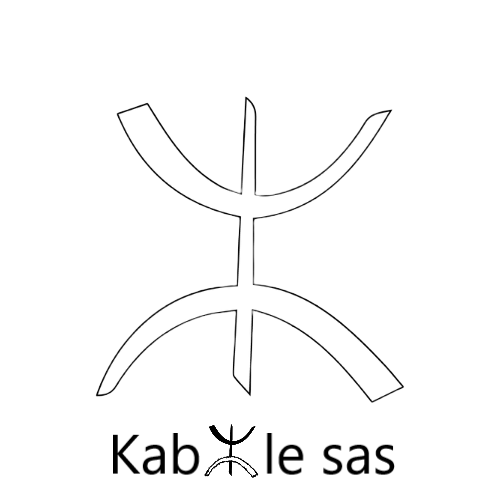

<!------>
<!------>

  
<!------>
# PASKA by Kabyle
## Ingreso al sistema
 
**NOTA: Poner las imágenes de la secuencia de pantallas desde URL en navegador, página de acceso en Paska, clave y usuario, y pantalla de acceso al sistema**
 
 
#####  [Anterior](./4-AreasYPerfiles.md)

##### [Indice de contenido](./0-IndicePpal.md) 

##### [Inicio](./README.md)  

<!---#### [Contacto](./Contacto.md)--->
 
