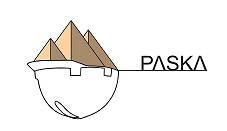

<!------>
<!------>

<!------>
# PASKA by Kabyle
## Gestión del Tiempo (M2)
###
### [M2.1 - Calendario laboral](./M2.1-CalendarioLaboral.md)
### [M2.2 - Plan de tareas](./M2.2_PlanTareas.md)
### [M2.3 - Ingreso de operarios al turno](./M2.3_IngresoOperariosTurno.md)
### [M2.4 - Asignación de operarios a tareas](./M2.4_AsignacionOperariosATareas.md)
### [M2.5 - Operarios presentes](./M2.5_OperariosPresentes.md)
### [M2.6 - Operarios ausentes](./M2.6_OperariosAusentes.md)
### [M2.7 - Informes](./M2.7_Informes_caratula.md)
### [M2.8 - Alertas](./M2.8_Alertas.md)

##### [Índice de módulos](./2-IndiceDeModulos.md) 
##### [Índice de contenido](./0-IndicePpal.md) 
##### [Inicio](./README.md)  
<!---#### [Contacto](./Contacto.md)--->
 
